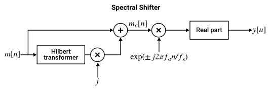
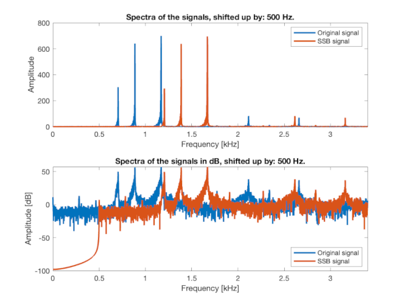

# Upper Single Sideband (SSB) modulation using Hilbert transform and phase method

Digital Signal Processing SS2025 - University of Applied Sciences Offenburg

This Digital Signal Processing course project explores the upper Single Sideband (SSB) modulation of an audio signal using the Hilbert transform and the phase method and implements it in a MATLAB script.

- The script loads an audio signal, windows it, computes its analytic signal using the Hilbert transform, and modulates it with a complex carrier signal, to obtain the upper SSB modulation.
- The spectra of both signals (original and modulated) are plotted to visualize the frequency shift.
- To demonstrate the effect of the modulation, both signals are also played back sequentially via speakers for comparison.

---
**Block diagram of the spectral shifter implemented**

---
**Spectra of MATLAB example audio and the associated SSB modulated signal (example *train.mat*)**

## References
* [MATLAB Single Sideband Modulation](https://de.mathworks.com/help/signal/ug/single-sideband-modulation-via-the-hilbert-transform.html?searchHighlight=single%20sideband%20modulation&s_tid=srchtitle_support_results_2_single%20sideband%20modulation)